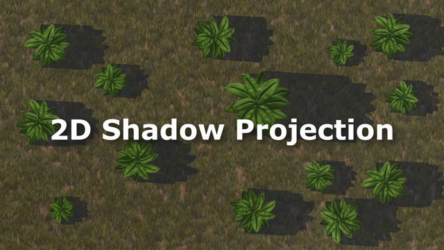

# 2D Shadow Projection

**Author:** Kevin Wei
**Created:** 3/21/2019

### *Click image to watch the Youtube video*

## Details
2D Shadow Projection is a system that I wrote in Unity to simulate real-time dynamic shadows in 2D. With regards to the various field-of-view / visibility methods that make use of the stencil buffer, I wanted to try a new approach by producing shadow objects with meshes, using vector math. My motivation for this project was to discover a way to simulate the sun in top-down perspective.

The shadow effect is achieved by generating a series of meshes that extend from the outer vertices of a sprite. I first find all the boundary edges of a sprite with normals pointing from each edge. Then I take the dot product of each normal and the direction of a “light” source, with positive values indicating that they are pointing in the same direction. This gives me the edges that I will project shadows from. Finally, I gather up all the vertices of the projection to create triangles that build up the shadow mesh.

The shadow material uses a stencil shader which also multiplies the color of the surface beneath it, but stencilling is only used to remove the dark spots when shadow meshes overlap. My biggest challenges were related to clockwise versus counter-clockwise operations, such as finding normals that pointed in the correct direction, as well as providing the correct order of triangles to the generated mesh array.